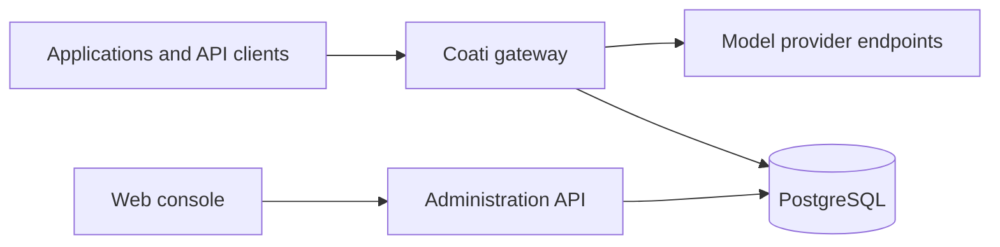

<p align="center">
  
</p>

<h1 align="center">Coati</h1>

<p align="center">
  <strong>A self-hosted model gateway for teams.</strong><br>
  Route model requests, manage access, and track usage from one control plane.
</p>

<p align="center">
  <a href="https://github.com/robeshell/coati/actions/workflows/ci.yml"></a>
  <a href="LICENSE"></a>
  <a href=".nvmrc"></a>
  <a href="apps/api/tsconfig.json"></a>
</p>

<p align="center">
  <a href="#quick-start">Quick start</a> ·
  <a href="#connect-an-application">API access</a> ·
  <a href="#architecture">Architecture</a> ·
  <a href="#documentation">Documentation</a> ·
  <a href="#contributing">Contributing</a>
</p>

---

Coati sits between your applications and model providers. Applications connect to a shared API endpoint; administrators manage provider credentials, model routes, permissions, and quotas in a web console.

Expose stable model names to your applications while controlling how requests reach upstream accounts. Keep provider credentials on the server, issue separate access keys to users, and inspect requests and token usage in one place.

## Capabilities

| Area | What Coati provides |
| --- | --- |
| **Model APIs** | OpenAI Chat Completions, OpenAI Responses, and Anthropic Messages interfaces, with JSON and SSE protocol conversion. |
| **Routing** | Public model routes, account pools, fallback candidates, session affinity, and credential health management. |
| **Access control** | Users, roles, model permissions, personal access keys, device authorization, and revocable sessions. |
| **Usage controls** | Shared quota reservations, daily token limits, request admission limits, and usage settlement. |
| **Operations** | Request logs, token and cache usage reports, audit records, and optional account recovery probes. |
| **Administration** | A React console for model services, routes, personal channels, access management, and system settings. |

Protocol conversion follows explicit policies for fields that cannot be represented across APIs. See the [protocol guide](docs/gateway/protocol.md) for reasoning content, storage semantics, and error handling.

## Quick start

### Deploy with Docker Compose

**Requirements:** Git, Docker with the Compose plugin, and OpenSSL.

```sh
git clone https://github.com/robeshell/coati.git
cd coati
bash setup.sh
```

The setup script prompts for an administrator password of at least 12 characters and a listening port. It generates independent database, session, and credential-encryption secrets in `.env.production`, builds the application, and starts it with PostgreSQL. Existing configuration is reused on subsequent runs.

Open **http://localhost:8080** and sign in as **`admin`** with the password you chose. If you selected a different port, use that port instead.

```sh
# Check service status
docker compose --env-file .env.production ps

# Follow application logs
docker compose --env-file .env.production logs -f app

# Stop the services while retaining data volumes
docker compose --env-file .env.production down
```

The default deployment binds to `127.0.0.1`. For remote access, configure an HTTPS reverse proxy and disable response buffering for SSE. Back up the database and encryption keys together: stored provider credentials cannot be recovered without their encryption key. See [deployment and operations](docs/gateway/operations.md).

### Configure your first model

1. **Add a model service.** Configure an upstream endpoint and its account credentials in the console.
2. **Create a public route.** Choose the model name applications will use and configure its upstream account selection.
3. **Issue an access key.** Grant the user access to the required models and set the appropriate limits.
4. **Send a request.** Use the gateway URL, access key, and public model name in your application.

## Connect an application

Use `http://localhost:8080/api/agent/v1` as the API base URL for clients that accept a custom endpoint. Replace the host with your deployment address.

| Interface | Endpoint |
| --- | --- |
| Chat Completions | `POST /api/agent/v1/chat/completions` |
| Responses | `POST /api/agent/v1/responses` |
| Messages | `POST /api/agent/v1/messages` |

For a first request, set `COATI_API_TOKEN` to your gateway access key and `COATI_MODEL` to a public model name configured in the console:

```sh
export COATI_BASE_URL="http://localhost:8080"
export COATI_MODEL="your-public-model"

curl --fail-with-body "$COATI_BASE_URL/api/agent/v1/chat/completions" \
  -H "Authorization: Bearer $COATI_API_TOKEN" \
  -H "Content-Type: application/json" \
  -d "{\"model\":\"$COATI_MODEL\",\"messages\":[{\"role\":\"user\",\"content\":\"Hello\"}]}"
```

Set `"stream": true` in the request body and use `curl --no-buffer` to consume SSE output. Coati also exposes `/v1` aliases for these model APIs.

For applications using browser-approved sign-in, the [Node.js device authorization example](examples/device-auth/README.md) demonstrates authorization, polling, and authenticated requests without third-party dependencies.

## Architecture



Coati is a TypeScript monorepo. The API uses **Node.js, Fastify, Zod, Drizzle, and PostgreSQL**; the console uses **React, Vite, shadcn/ui, and Tailwind CSS**.

The gateway handles authentication, route selection, quota reservation, upstream execution, streaming, and usage settlement. Model API authentication is separate from the console's cookie and CSRF flow. Request lifecycle controls cover client cancellation, bounded buffering, and graceful shutdown. PostgreSQL stores configuration, credential ciphertext, access-key digests, quota reservations, and operational records.

| Directory | Responsibility |
| --- | --- |
| [`apps/api`](apps/api) | Gateway runtime, administration APIs, database schema, and backend tests. |
| [`apps/web`](apps/web) | Administration console, shared UI components, and frontend tests. |
| [`docs`](docs) | Architecture, protocol contracts, configuration, and operations. |
| [`examples`](examples) | Standalone integration examples. |
| [`scripts`](scripts) | Verification and container smoke-test tooling. |

## Local development

**Requirements:** Node.js 22.19 or later, pnpm 11, and PostgreSQL 14 or later. The repository pins its pnpm version in [`package.json`](package.json).

```sh
git clone https://github.com/robeshell/coati.git
cd coati
pnpm install --frozen-lockfile

createdb coati_node_dev
createdb coati_node_test
cp apps/api/.env.example apps/api/.env.development
```

Edit `apps/api/.env.development` to match your local database connection. Set `SECRET_KEY` and `GATEWAY_ENCRYPTION_KEY` to separate random values; `openssl rand -hex 32` can generate each value. Set `ADMIN_PASSWORD` to your chosen local administrator password.

```sh
# Initialize the database and synchronize permissions
pnpm setup-once

# Start the API and console with live reload
pnpm dev
```

| Service | Default development address |
| --- | --- |
| Console | http://localhost:5175 |
| API | http://localhost:5004 |
| Health check | http://localhost:5004/health |

### Validation

Use a dedicated test database. Set `TEST_DATABASE_URL` in your shell or `apps/api/.env.test`; keep it separate from development and production data.

```sh
export TEST_DATABASE_URL="postgresql://localhost/coati_node_test"

pnpm lint
pnpm typecheck
pnpm test
pnpm build
pnpm verify
pnpm verify:gateway
node --test examples/device-auth/device-auth.test.mjs
```

`pnpm verify` checks types, database schema state, OpenAPI synchronization, documentation paths, frontend build, backend and frontend tests, and the gateway static checks. `pnpm verify:gateway` runs the focused gateway contract suite. Tests use isolated databases and mock upstreams; they do not call live model providers. See the [testing guide](docs/gateway/testing.md) for container smoke tests and additional checks.

## Documentation

| Guide | Contents |
| --- | --- |
| [Gateway architecture](docs/gateway/architecture.md) | Service boundaries, request lifecycle, and data ownership. |
| [Protocol behavior](docs/gateway/protocol.md) | API interfaces, conversion policies, streaming, and authorization. |
| [Configuration](docs/gateway/configuration.md) | Environment variables, credentials, quotas, and optional services. |
| [Deployment and operations](docs/gateway/operations.md) | Installation, reverse proxies, backups, and upgrades. |
| [Testing](docs/gateway/testing.md) | Validation commands, isolated environments, and smoke tests. |
| [OpenAPI specification](docs/apifox-full.openapi.json) | API paths, request schemas, and response contracts. |
| [Backend architecture](docs/architecture.md) | Module layering, conventions, and development tooling. |
| [Frontend design system](docs/frontend-design-system.md) | Shared components, styling, and UI conventions. |

The README is maintained in English. The gateway guides currently use Chinese; source code, integration examples, and the OpenAPI specification are available alongside them.

## Contributing

Bug reports and pull requests are welcome. For substantial changes, open an [issue](https://github.com/robeshell/coati/issues) to discuss the problem and proposed scope first.

Include reproduction steps for bug reports. For code changes, describe the behavior being changed and the checks you ran. Follow the module boundaries in [AGENTS.md](AGENTS.md), add focused regression coverage where appropriate, and run the relevant validation commands before submitting a pull request. Use synthetic credentials and isolated databases in tests.

## License

Coati is licensed under the [Apache License 2.0](LICENSE).

Built on [castor-kit](https://github.com/robeshell/castor-kit), which is MIT licensed. Its license is preserved in [THIRD_PARTY_LICENSES/castor-kit.txt](THIRD_PARTY_LICENSES/castor-kit.txt); see [NOTICE](NOTICE) for attribution.
