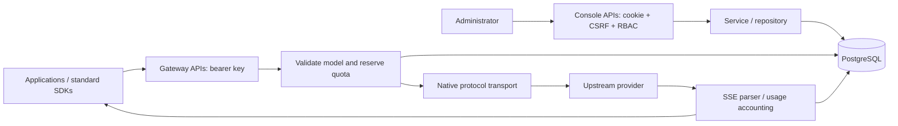

# Architecture and design decisions

## Product boundaries

The primary navigation is gateway overview, upstream services, public models/routes, access keys/device authorization, and request diagnostics. castor-kit supplies login, RBAC, audit, system management and reusable console controls. Its component-center routes/pages and public demo reset mechanism are removed. The initial inherited database migrations still contain unused example tables; they are not gateway capabilities and should be removed in a dedicated schema cleanup before release.

The management console and model gateway share one deployable service initially. They are separate Fastify plugin scopes:

No database transaction or connection is held for the duration of upstream streaming. PostgreSQL is the shared authority for credentials, reservations, usage, and one-time device redemption. There is no process-local correctness dependency for quotas. Device-start rate limiting is currently process-local and is not a fleet-wide abuse-control guarantee.

## Request lifecycle

1. Authenticate the gateway key independently of console cookies. Check expiry/revocation, allowed model, enabled upstream and route.
2. In a short transaction, lock the key row and reserve estimated input plus requested output tokens. Enforce per-key UTC-day token budget, concurrency, and requests per minute. `daily_limit=0` means unlimited; this requires care when issuing keys. Token estimates are not model tokenization guarantees.
3. Release the transaction before I/O. Use pooled HTTP connections, a 180s overall deadline and a 30s stream-idle deadline. The client disconnect aborts the upstream request.
4. Rewrite the model name in the request and response. Forward native protocol payloads; SSE is parsed across arbitrary byte/event boundaries with a 1 MiB event limit and bounded downstream buffering. Responses storage/background/previous-response chaining is unsupported; storage is forced off. Multiple completions (`n>1`) are rejected.
5. Retry only explicit 429/503 responses before streaming begins, across at most three configured routes in priority order. Connection failures, streams that have begun and ambiguous completion failures are not automatically retried. This reduces duplicate generation/billing risk. This is not the legacy adaptive scheduling implementation.
6. Settle a reservation once, recording usage source (`upstream` or `estimated`), status, first-event latency, total latency, and upstream attempts. Missing final stream events are errors; never fabricate `[DONE]` on failure. If the process dies before settlement, the expiry reaper marks the request interrupted and provisionally charges its reservation.

## Data model

| Entity | Purpose |
| --- | --- |
| gw_upstreams | Native protocol, API base, encrypted provider credential, enabled flag |
| gw_routes | Public name → upstream model, priority and enabled flag |
| gw_keys | Owner, digest, model allowlist, lifetime and per-key limits |
| gw_requests | Reservation, terminal status, actual/estimated usage and timing |
| gw_attempts | Upstream selected, HTTP outcome, redacted diagnostic and duration |
| gw_devices | Hashed device secret, short verification code, approval state and expiry |

Key plaintext is never returned by list APIs. Revocation is checked again under the reservation lock. Administration uses the existing central permission helper. Request/response bodies are not retained as usage logs; upstream error excerpts are bounded and credential-redacted, but may contain provider diagnostics.

## Migration strategy

Keep Python and Node databases separate. Importing Python schema into the same database or renaming Python tables in place is unsupported. Future export/import must preserve an explicit source-to-target ID map, scope boundaries, credential formats, UTC timestamps and actual versus estimated usage. Password hash compatibility alone is not identity or authorization migration acceptance.

Cut over an isolated test client first, then a small explicitly selected cohort. Maintain a reverse-proxy rollback route to the Python deployment. Do not dual-send billable generation as a shadow test. The migration tool, cohort routing, and reconciliation are future work, not implemented switches in this preview.
