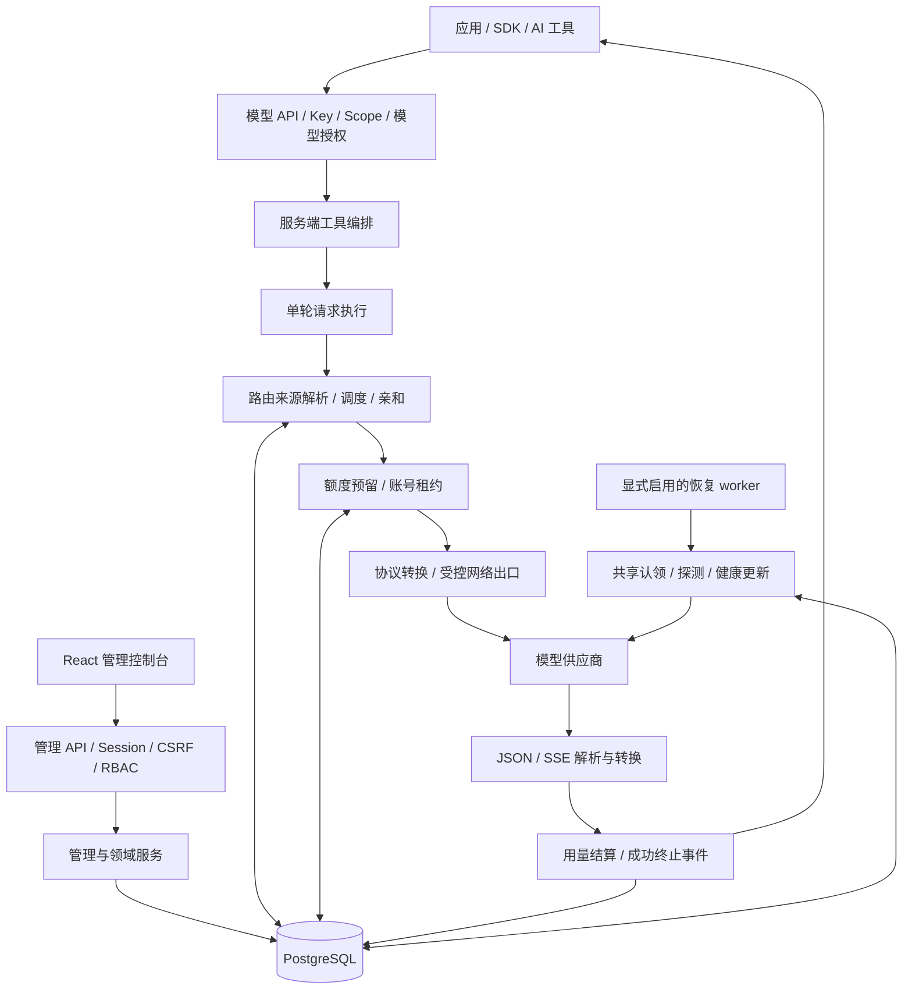
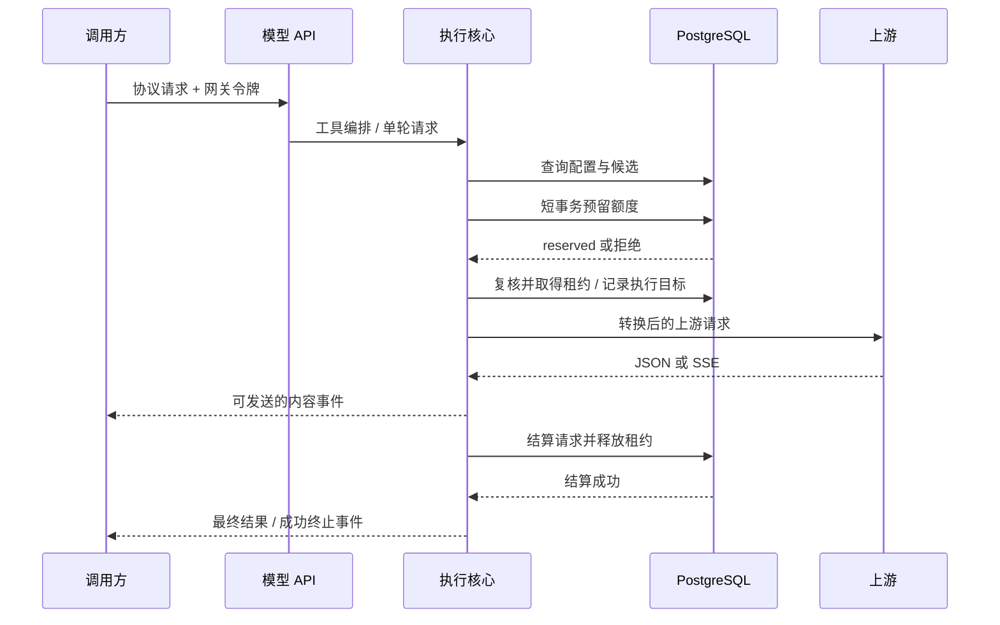

# Coati 模型网关现状架构与实现索引

> 本文描述现有实现，不是 Node.js 目标架构。目标设计见 [node-target-architecture.md](node-target-architecture.md)，差距及实施顺序见 [node-architecture-gap-plan.md](node-architecture-gap-plan.md)。

更新：2026-09-26。本文依据 Node 实现整理，替代早期预览架构；Python 行为差异以 [behavior-parity.md](behavior-parity.md) 为准，交付状态以 [roadmap.md](roadmap.md) 为准。

当前系统是模块化单体 API、React 控制台、独立恢复 worker 和 PostgreSQL。不是微服务集群，也没有引入 LiteLLM/pi-ai。本文区分当前实现、明确边界和后续设计，不把架构描述当成生产验收。

## 1. 产品与部署边界

- 模型网关：平台模型服务、个人渠道、公开模型路由、三协议接入、授权、额度、用量、搜索/抓取、健康恢复。
- 系统管理：castor-kit 提供登录、用户、角色、菜单、审计及通用管理基础。
- 控制台与网关共用 Fastify 进程，但使用独立插件范围。模型接口不经过管理 Cookie、CSRF、响应翻译和压缩处理。
- API、恢复 worker 共用数据库；worker 默认不自动发起模型探测，需要显式启用。
- Python `portal/` 是只读参考，数据库与 Node 分开。desktop、CLI、Agent 插件、公司发行服务不在本项目范围。
- PostgreSQL 是配置和关键运行状态的共享事实源；当前不依赖 Redis 或消息队列。多实例支持不等于已验证生产容量。

```mermaid
flowchart TB
  UI[React 管理控制台] --> Admin[管理 API / Session / CSRF / RBAC]
  Client[应用 / SDK / AI 工具] --> API[模型 API / Key / Scope / 模型授权]
  Admin --> Services[管理与领域服务]
  API --> Tools[服务端工具编排]
  Tools --> Execution[单轮请求执行]
  Execution --> Routing[路由来源解析 / 调度 / 亲和]
  Routing --> Reserve[额度预留 / 账号租约]
  Reserve --> Bridge[协议转换 / 受控网络出口]
  Bridge --> Provider[模型供应商]
  Provider --> Stream[JSON / SSE 解析与转换]
  Stream --> Settlement[用量结算 / 成功终止事件]
  Settlement --> Client
  Services --> DB[(PostgreSQL)]
  Routing <--> DB
  Reserve <--> DB
  Settlement --> DB
  Worker[显式启用的恢复 worker] --> Probe[共享认领 / 探测 / 健康更新]
  Probe <--> DB
  Probe --> Provider
```

部署入口：根目录 `setup.sh`、`Dockerfile`、`docker-compose.yml`、`docker-entrypoint.sh`。启动执行迁移和增量 RBAC 初始化。详细备份、SSE 代理和切换限制见 [deployment.md](deployment.md)。

## 2. 模块职责与依赖方向

逻辑依赖为 `HTTP routes → 领域 service → repository → schema/PostgreSQL`。纯策略和协议转换函数不依赖 HTTP；事务必须完整留在 repository，网络 I/O 不持有数据库事务。

| 模块 | 职责 | 不应承担 | 当前入口 |
| --- | --- | --- | --- |
| HTTP 入口 | 路由、鉴权、请求归属、状态码、响应序列化、连接取消 | 直接读写 repository、SQL、业务事务 | [routes.ts](../../apps/api/src/modules/gateway/routes.ts)，[app.ts](../../apps/api/src/app.ts) |
| 管理用例 | 管理查询、撤销、停用、资源不存在处理；兼容接口适配 | 持有 HTTP reply、改变调度策略 | [admin-service.ts](../../apps/api/src/modules/gateway/admin-service.ts)，`legacy-*.ts` |
| API 运行时 | 统一拥有管理/模型接口共用的服务和 transport；回收单飞及关闭排序 | 路由自行关闭共享资源 | [runtime.ts](../../apps/api/src/modules/gateway/runtime.ts) |
| 网关服务门面 | 组装 repository/vault/transport；账号、令牌、设备、目录等服务入口 | 混入整段流式执行状态机 | [service.ts](../../apps/api/src/modules/gateway/service.ts) |
| 单轮执行 | 请求校验、候选计划、预留、尝试、响应流、结算和取消 | 管理页面 CRUD、设备兑换 | [execution.ts](../../apps/api/src/modules/gateway/execution.ts) |
| 调度策略 | 优先级、加权选择、负载、健康惩罚、会话标识 | 发 HTTP 请求或直接操作数据库 | [selection.ts](../../apps/api/src/modules/gateway/selection.ts)、[scheduling-policy.ts](../../apps/api/src/modules/gateway/scheduling-policy.ts)、[session-affinity.ts](../../apps/api/src/modules/gateway/session-affinity.ts) |
| 协议兼容 | 三协议 JSON/SSE 适配、字段约束、签名和事件顺序 | 选择账号、额度结算 | `protocol/`、`stream.ts`、`bridge-policy.ts` |
| 网络出口 | 地址与 DNS 策略、TLS、代理、连接和响应限制 | 供应商调度决策 | [transport.ts](../../apps/api/src/modules/gateway/transport.ts)、`upstream-endpoint.ts` |
| 用量与额度 | 归一化、来源标记、预留策略、统计和导出 | 假造供应商未报告计数 | `usage.ts`、`quota-policy.ts`、`usage-*.ts` |
| 服务端工具 | 原生能力判断、函数回退、多轮执行、搜索/抓取、父子记录 | 执行客户端任意函数工具 | `server-tool-loop.ts`、`tool-execution.ts`、`web-search.ts` |
| 设备存储 | 全局准入、确认状态、一次性领取令牌的完整事务 | HTTP 状态码或明文令牌生成 | [device-repository.ts](../../apps/api/src/modules/gateway/device-repository.ts) |
| 网关存储门面 | 账号、路由、租约、额度与账本事务；兼容既有调用契约 | 供应商 HTTP I/O | [repository.ts](../../apps/api/src/modules/gateway/repository.ts) |
| 模型能力/缓存验证 | 目录覆盖与同步、受控验证执行、结果查询 | 自动截断用户上下文、网关响应缓存 | [model-profile.ts](../../apps/api/src/modules/gateway/model-profile.ts)、[cache-test.ts](../../apps/api/src/modules/gateway/cache-test.ts) |
| 恢复与迁移 | 过期状态回收、探测、离线导出导入、密钥轮换 | 无授权的真实压测、直接修改 Python 库 | [probe-runner.ts](../../apps/api/src/modules/gateway/probe-runner.ts)、[legacy-import.ts](../../apps/api/src/modules/gateway/legacy-import.ts)、[legacy-archive.ts](../../apps/api/src/modules/gateway/legacy-archive.ts)、`credential-rotation.ts` |

本次拆分保留 `GatewayService.execute()` 与 `GatewayRepository` 的调用契约，通过组合委托实现；没有用继承改变状态和事务归属。`execution.ts` 依赖显式执行上下文，不依赖 HTTP。

管理路由可向领域服务传入认证用户、已解析路径参数与请求体。`app.db` 仅用于组装服务。ESLint 禁止网关路由导入 repository/Drizzle 或访问 `.repo`，防止重新跨层。

## 3. 请求时序

模型/外部搜索入口先通过 Runtime 节点准入和正文预算，再执行下述鉴权/业务流程。生命周期持续到响应与异步清理均结束。默认并发 256、正文/编码流事件预算 64 MiB；它们不是整个进程的 RSS 上限。详见[当前实现边界](node-architecture-gap-plan.md#2026-09-27请求生命周期与节点保护)。

1. 从 Bearer / `x-api-key` / `api-key` 取得令牌，验证有效性。模型调用与管理会话分开。
2. 工具入口校验统一兼容策略；普通请求直接进入单轮执行，服务端工具按能力选择原生或回退路径。
3. 校验请求、`chat` scope、授权模型、Responses 存储限制，生成请求 ID 与脱敏上下文。
4. 解析候选来源：匹配的个人渠道 → 已配置公开路由 → 旧显式路由 → 直接模型名称的平台池。特定请求允许能力候选或显式环境配置兜底。
5. 过滤模型声明、冷却、图像目标和协议转换能力，再按优先级、会话、负载与健康策略排序。
6. 在短事务中锁定 Key、用户额度记录，重新验证授权，按同一数据库时间检查额度/并发/频率，创建 `reserved` 请求。
7. 取得账号租约时复核最新路由、模型声明、归属、健康和绑定；写入本次实际执行快照，再解密凭证并发请求。
8. 按上游协议生成鉴权与请求体，改写实际模型；响应还原对外模型名。JSON 转换或 SSE 处理期间接收取消与超时。
9. 记录尝试、更新健康、释放账号租约并条件结算。成功终止事件在源流完成且结算成功后释放。
10. 中断/错误保留请求诊断；进程死亡由过期回收处理，不能把没有观察到的用量当成实际计费。

```mermaid
sequenceDiagram
  participant C as 调用方
  participant A as 模型 API
  participant E as 执行核心
  participant D as PostgreSQL
  participant P as 上游
  C->>A: 协议请求 + 网关令牌
  A->>E: 工具编排 / 单轮请求
  E->>D: 查询配置与候选
  E->>D: 短事务预留额度
  D-->>E: reserved 或拒绝
  E->>D: 复核并取得租约 / 记录执行目标
  E->>P: 转换后的上游请求
  P-->>E: JSON 或 SSE
  E-->>C: 可发送的内容事件
  E->>D: 结算请求并释放租约
  D-->>E: 结算成功
  E-->>C: 最终结果 / 成功终止事件
```

鉴权失败和部分前置语法错误不保证有 `gw_requests` 记录；不能把请求账本宣称为所有 HTTP 流量的访问日志。

## 4. 路由与调度契约

公开模型名与供应商真实模型名分离。个人渠道命中后拥有此次选择，即使全部冷却也不会静默落到平台账号。已存在但停用的路由不能被直接模型池绕过。

| 场景 | 当前选择方式 |
| --- | --- |
| 公开路由绑定主账号 | 主账号优先；显式开启回退后才选择其他账号 |
| 平台有效会话绑定 | 优先复用，租约事务再复核，不可用时失效重选 |
| 平台新会话/活跃负载 | 优先级分桶，按 `(绑定数 + 活跃数 + 1) / 权重` 选择 |
| 个人渠道显式会话 | 加权确定性哈希，不写平台会话绑定 |
| 个人渠道无会话、有活跃负载 | 加权活跃负载，平局用加权随机排序 |
| 无负载/亲和条件 | 优先级与加权随机排序 |

默认最多 3 次实际尝试，候选窗口默认 7；配置可调整。实际重试依据 `upstream-failure.ts`：认证/余额相关即时故障、408、429、5xx 以及白名单内的连接错误均可能触发切换，并更新健康状态。不是仅重试 429/503，也不保证上游网络错误意味着供应商未执行。流式正文开始后不自动重新生成；此系统没有跨供应商 exactly-once 计费保证。

旧候选路由及其迁移界面保留，按用户决定冻结；此次职责拆分没有重新设计、删除或修改其配置。

## 5. 协议、工具和网络边界

### 协议矩阵

Chat Completions、Responses、Messages 的 3×3 入站/出站组合独立于账号选择。同协议保留原生路径，仍受模型改写、输出额度、存储禁用等网关策略约束，不是逐字节透传。

JSON 使用六个成对转换器。跨协议 SSE 以 Chat 风格事件为中间表示，并额外保留签名/加密推理、工具和事件顺序；尚未迁为完全协议中立的 IR。新增第四协议属于后续设计。

- 默认兼容策略 `python`；`strict` 对不可表达控制项执行更严格拒绝。
- 推理默认 `preserve`；`text-only` 必须显式选择。签名不因格式转换而获得另一供应商的有效性。
- 不提供 Responses 服务端历史存储/背景执行/历史引用；上游 `store` 强制关闭。不支持多候选补全。
- SSE 单事件上限 1 MiB，跨协议累计源事件预算 16 MiB，下游 Readable 高水位 64 KiB。
- 默认请求总期限 180 秒，流空闲配置 300 秒并受账号请求超时约束；总期限仍更早生效。工具、独立搜索和缓存验证有各自入口期限，不能把全系统都描述成同一个超时。
- 源终止事件缺失、转换失败或结算失败时不能生成伪成功 `[DONE]`。

具体字段和能力边界见 [protocol-contract.md](protocol-contract.md)。

### 服务端工具

普通函数工具由调用方执行，网关负责表达转换。搜索/抓取才属于网关可执行的服务端工具。原生工具支持的观察结果按账号配置指纹缓存于进程内；它是优化线索，不是跨实例持久能力声明。

回退路径：模型工具调用 → 受限搜索/抓取 → 结果回填 → 下一轮模型请求。各轮保留账本，工具子记录关联实际发起轮次。限制轮数、次数、体积、域名和取消传播。多轮合计保留已报告值，通过 `coati_usage.partial_fields` 标注缺失。

函数回退采用完成后缓冲 SSE；原生 Responses 可以保留实时 SSE。不能用同一个“流式”标签推断首字延迟。详见 [server-tools.md](server-tools.md)。

### 网络出口

默认公网 HTTPS，连接时检查 DNS，禁止自动重定向，路由路径覆盖不得跨账号 origin。个人代理与管理员配置的平台代理有不同信任边界：平台受信代理可在代理端解析目标域名，个人代理需要额外目标/代理地址约束。TLS 身份验证保持开启。详见 [egress-policy.md](egress-policy.md)。

## 6. 状态、事务与数据归属

| 状态/数据 | 表或存储 | 事务与生命周期 |
| --- | --- | --- |
| 模型服务/个人渠道 | `gw_upstreams` | 加密凭证、模型声明、归属、健康与探测认领；不向客户端返回明文 |
| 路由 | `gw_public_routes`、`gw_routes` | 前者公开池/绑定配置，后者旧显式候选；`gw_route_migrations` 记录旧迁移操作 |
| 网关令牌 | `gw_keys` | 保存 SHA-256 摘要；预留事务复查撤销、期限、scope 与模型授权 |
| 用户额度 | `gw_user_limits` | 同用户多个 Key 共用锁定与预算，业务日按配置时区计算 |
| 请求账本 | `gw_requests` | `reserved` → 条件结算终态；写入输入/输出、缓存、来源、耗时和目标快照 |
| 尝试记录 | `gw_attempts` | 每次上游尝试的目标、状态、耗时和脱敏错误；不存完整提示词/响应正文 |
| 账号占用 | `gw_upstream_leases` | 事务准入，成功/失败释放，死亡后按到期回收 |
| 会话绑定 | `gw_session_bindings` | 共享绑定、过期与失效复查，作用域经散列处理 |
| 设备授权 | `gw_devices`、`gw_device_rate_limits` | 数据库共享限流；确认锁行；领取令牌和消费设备码在同一事务 |
| 模型能力目录 | `gw_model_profiles` | 管理覆盖 → 目录值 → 默认值；当前不是请求执行硬限制或上下文截断器 |
| 缓存验证/搜索 | `gw_cache_tests`、`gw_search_settings` | 受控验证记录与加密搜索设置；不是模型回答缓存 |
| 导入审计 | `gw_legacy_imports` | 离线事务导入与快照校验，重复相同快照幂等 |

输入归一化计数包含缓存，输出包含推理；不能再次相加造成重复计费。未报告为 null，报告零为 0。上游计数不足时估算并标明来源。过期预留标记 `interrupted`、来源 `unknown`，输入/输出记零并保留未知原因、释放预留；零不是已证明供应商无消耗。

普通终结释放租约与结算是独立数据库操作，不宣称跨操作原子性；`reserved` 条件更新和回收负责失败收敛。数据库事务不跨越供应商网络调用。

设备状态主要为 pending → approved/denied → consumed，过期转 expired；领取使用行锁避免重复兑换。设备共享准入不是进程内 Map。

## 7. 恢复、统计与运行约束

- API Runtime 每 30 秒触发过期预留/租约回收和缓存验证中断恢复；实例内上一轮未结束时不重复启动，跨实例仍依赖数据库条件更新。关闭先等待在途回收，再关闭共享 transport，最后关闭自有 DB 池。
- 独立 worker 默认关闭探测。开启后默认 300 秒一批、每批 5 个、静默期 600 秒。数据库认领、凭证快照和结果时间防止重复探测及旧结果覆盖。
- 退出先停止接受新的后台探测，等待正在运行的批次并关闭 transport；部署宽限期见 Compose。
- 管理总览、全员日志、个人用量的身份范围不同。前端通过共享 request 调用 API，服务端负责权限/归属。缓存命中率只依据已报告计数，不能拿缺失字段当零提高命中率。
- 当前统计从 PostgreSQL 查询；未提供数据仓库、全量分布式 tracing 或通用请求日志保留期任务。规模化优化另行评估，不包装成迁移缺失功能。
- 组件示例业务已从路由移除，但基础 schema/历史迁移仍有示例表；清理需独立迁移，不能直接删除旧 migration。

## 8. 实现与验证索引

以下源码相对 `apps/api/src/modules/gateway/`。验证文件位于 `apps/api/test/`，前端位于 `apps/web/test/`。测试存在或通过不等于所有供应商/生产环境验收。

| 架构要求 | 实现位置 | 已有行为验证 |
| --- | --- | --- |
| 管理/模型入口隔离 | `../../app.ts`、`routes.ts`、`admin-service.ts` | `gateway.test.ts` 权限、CSRF、设备与个人隔离；ESLint 路由层限制 |
| 调度与租约复核 | `execution.ts`、`selection.ts`、`repository.ts` | `gateway-selection.test.ts`、`gateway.test.ts` 调度/并发/进程恢复 |
| 三协议 JSON/SSE | `protocol/bridge.ts`、`protocol/stream-bridge.ts` | `gateway-matrix.test.ts`、协议/SDK/stream 系列 |
| 原子额度与诚实结算 | `repository.ts`、`usage.ts`、`stream.ts`、`settlement-buffer.ts` | `gateway.test.ts` 额度/结算失败、matrix 用量/取消、usage 系列 |
| 一次性设备授权 | `service.ts`、`device-repository.ts` | `gateway.test.ts` 设备权限、过期、重复兑换、并发 |
| 工具闭环 | `server-tool-loop.ts`、`tool-execution.ts` | `gateway-server-tools.test.ts`、`gateway-web-search.test.ts` |
| 受控网络出口 | `transport.ts` | `gateway-proxy-tls.test.ts` 与 transport/egress 相关测试 |
| 恢复探测 | `probe-runner.ts`、`repository.ts` | `gateway.test.ts` 认领、故障、跨进程恢复 |
| 管理与页面恢复 | `admin-service.ts`、`model-profile.ts`、`cache-test.ts`，web gateway pages | gateway API 及前端 settings、probe、cache、usage 等既有用例 |
| 离线迁移与部署 | `legacy-archive.ts`、`legacy-import.ts`，根目录 Docker 入口 | legacy 系列、migration-chain、setup-once、`scripts/smoke-container.mjs` |

## 9. 本轮符合性与保留边界

- 已修正文档与代码矛盾：共享设备限流、时区额度、重试分类、未知用量回收、已有离线迁移工具。
- 管理路由不再直接访问 repository；查询和资源不存在等处理进入管理/领域服务。部分纯序列化与旧接口兼容仍留在 HTTP 层，这是适配职责。
- 请求执行与设备事务已独立，旧门面委托保证接口兼容。`GatewayRepository` 的账号/调度/额度事务仍集中；未声称已拆成所有独立领域 repository。
- JSON 成对转换和 Chat 风格流中间表示、候选路由旧设计均未改动。模型能力目录也没有悄悄升级成硬限制。
- 没有新增迁移或数据库对象，没有调整用户账号/路由/密钥，没有修改 Python、Codex 配置或进行付费调用。
- 真实历史数据迁移、目标环境发布和切换仍是两项交付工作。本轮结构整理不替代它们。

## 10. 本轮验证记录

2026-09-26，基于 `e999b7f` 的本地职责重构：

- 工作区类型检查通过；网关静态门禁通过。
- 复用一轮既有工作区测试：前端 24 文件 100 项通过，后端 65 文件 1595 项通过；1 文件/2 项通用调度器 E2E 按原开关跳过。
- API/Web 构建通过。前端既有大 chunk 警告仍在，未将本轮扩展成打包优化。
- 不新增业务测试文件；复用既有 HTTP、设备、调度、工具、三协议、结算失败和故障恢复用例验证行为。
- 用 TypeScript 语法树规范化对照，确认执行函数只替换依赖上下文，四个设备事务函数体保持原样；路由 repository 导入/访问违规探针均被 ESLint 拒绝。
- 新的 HTTP 分层 ESLint 约束进入原静态门禁；它只约束当前网关入口，不声称对整个仓库做了依赖图形式化验证。
- 以上是本地修改的证据；此前 `e999b7f` 远端 CI 通过不能替代本次改动的远端 CI。
