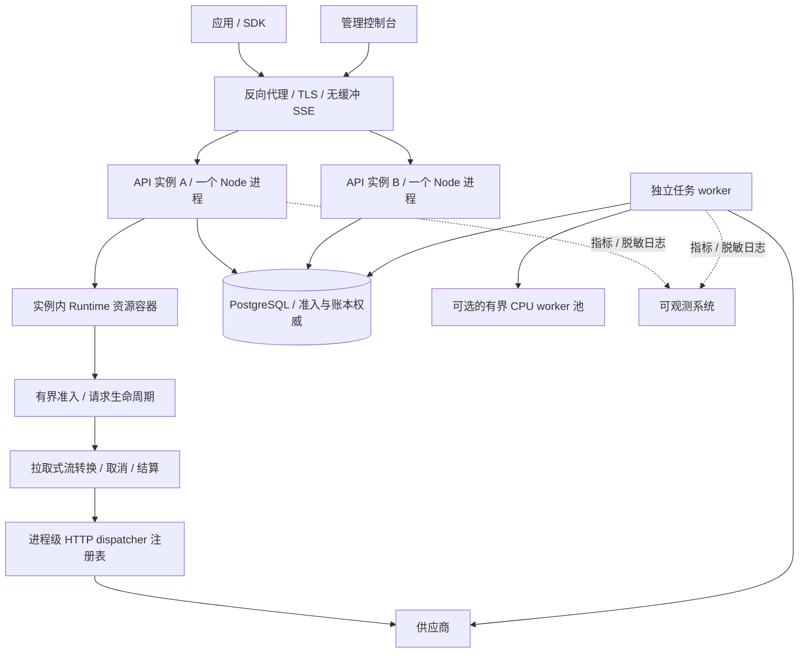
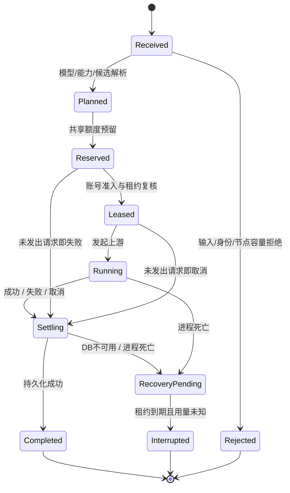

# Coati：面向 Node.js 的目标架构设计

状态：设计提案 v1，2026-09-26。用户已确认采用“先设计、再对照、再重构”的方向；本文具体接口和性能参数尚未实施或验证。不是当前代码完成声明，也不是用 TypeScript 重写 Python 文件布局。

设计基线：`e999b7f` 加本地职责拆分（执行核心、管理服务、设备 repository）。[architecture.md](architecture.md)描述现状；[node-architecture-gap-plan.md](node-architecture-gap-plan.md)记录差距和分阶段验收。Python 业务契约保留，候选路由重新设计继续冻结。

## 1. 设计目标与不可牺牲的约束

模型网关的主要负载是等待上游和持续转发长连接；性能目标是降低**网关自身开销**，并在慢客户端、供应商异常和多用户竞争下保持内存与延迟可控，不承诺 Node 会让模型生成更快。

优化顺序：可观测基线 → 有界并发和流处理 → 网络与数据库等待 → 必要的 CPU 隔离。优化必须保留以下契约：

1. 管理会话与模型令牌隔离，个人账号和请求归属不串用。
2. 用户/Key 额度与账号并发在多实例下仍有统一准入依据。
3. 结算必须持久化；缓存未报告不等于零；不把预留当成真实消耗。
4. 客户端断开后停止上游/工具工作；已发生用量仍尽力结算。
5. 不成功结算就不发送成功终止事件；不承诺供应商 exactly-once 执行。
6. 同协议路径尽量保留原生语义，跨协议有明确的可表达、显式有损和拒绝规则。
7. 不用无界 Promise、队列、连接池或对象缓存掩盖过载。

现阶段不引入微服务、Redis 或通用消息中间件。它们只有在实际瓶颈和故障隔离需求明确后才重新评估。

## 2. 运行拓扑与 Node.js 特性



图中的 Runtime 代表每个 API 实例各自拥有一份，不跨进程共享对象。初始小部署可只有一个 API 和一个按需 worker；多个 API 用部署副本利用多核，不同时叠加默认 cluster 多进程造成连接预算翻倍。

| 工作 | 执行位置 | 决策原因 |
| --- | --- | --- |
| 模型 HTTP/SSE、短 DB 操作 | API 事件循环上的异步 I/O | 利用 Node 对大量等待型连接的承载能力 |
| 小事件解析、短字段转换、小凭证加解密 | API，严格限制输入和单次工作量 | 避免跨线程传输比计算还贵 |
| 大导出、离线导入、统计回填、长缓存验证 | 独立任务 worker / 离线命令 | 与交互请求隔离 CPU、内存及 DB 连接预算 |
| 分析证实的 CPU 密集解析/编码 | worker 内有界 `worker_threads` 池 | 线程用于 CPU 工作，不为每个网络请求创建线程 |
| 探测/恢复 | 独立 worker，DB 认领 | 不让每个 API 副本都产生一份付费探测 |

`async` 不会把 JSON.parse、对象复制和同步计算自动移出主线程；libuv 的线程池也不会自动执行任意 JS。可切分的长循环按时间预算让出执行权，不能用 `await Promise.resolve()` 假装给网络 I/O 让出事件循环。依据：[Node 事件循环指南](https://nodejs.org/en/learn/asynchronous-work/dont-block-the-event-loop)、[worker_threads](https://nodejs.org/api/worker_threads.html)。

运行版本先以项目已有 Node 22 部署线为基线，CI、开发基准和镜像记录精确版本/镜像摘要。选型不依赖仅在更新主版本可用的 API，不在架构整理中顺便升级运行时。

## 3. 模块边界与资源所有权

采用一个代码库内的领域模块，不立即拆网络服务。

| 目标模块 | 输入/输出 | 拥有的资源或职责 |
| --- | --- | --- |
| `api` | HTTP ↔ 应用命令/结果 | 鉴权入口、状态码、连接关闭监听；不写 SQL |
| `identity` | Token → AccessContext | Key、scope、设备登录；不持有上游凭证 |
| `catalog` | 配置命令、版本化目录 | 账号/能力/模型配置、凭证版本；显式区分目录信息与强制限制 |
| `routing` | 请求需求 → ExecutionPlan | 只读选择计划、路由来源与候选原因；先封装现算法，不设计新候选产品 |
| `admission` | AccessContext + Budget → Permit | 节点容量、共享额度、账号租约；持久化状态转移 |
| `execution` | Plan + Permit → Outcome/事件流 | 一次请求生命周期，尝试策略、期限与终止，不兼任管理 CRUD |
| `protocol` | 原生载荷 ↔ 中立语义/事件 | 能力检查、签名和工具语义、增量转换；不认识数据库 |
| `transport` | PreparedRequest → UpstreamResponse | dispatcher 注册表、TLS/DNS/代理边界、连接与资源回收 |
| `tools` | 工具声明/调用 → 工具结果 | 只执行已支持的服务端工具，轮数、并发、字节预算和父子关联 |
| `accounting` | ObservedUsage + Permit → Settlement | 原始用量、归一化、条件结算、异常回收及审计事实 |
| `analytics` | 筛选 → 报表 | 派生统计、分页/导出；不得参与准入计费决策 |
| `jobs` | Job → Result | 认领、续租、重试、取消、清理；不假设副作用可重复 |

### 3.1 进程级 Runtime

在 Fastify 组装入口创建一次 `GatewayRuntime`，注册有界 dispatcher、配置缓存、节点准入、活动请求表和指标。管理服务、模型 API 共用其资源；关闭钩子只由 Runtime 所有者执行一次。worker 是独立 Runtime，拥有独立且更小的连接预算。

不让每次构造业务 Service 都隐式创建一套连接池。领域服务只持有必要接口，避免把 `db + repo + transport + vault` 全对象传遍所有模块。

### 3.2 接口草案（目标，尚未实现）

```ts
type AccessContext = Readonly<{
  ownerId: number; keyId: number; scopes: readonly string[];
  authorizationRevision: string;
}>;
type ExecutionPlan = Readonly<{
  requestedModel: string; configRevision: string;
  candidates: readonly CandidateRef[]; requirements: CapabilityRequirements;
}>;
interface Admission {
  reserve(access: AccessContext, plan: ExecutionPlan, budget: TokenBudget,
          signal: AbortSignal): Promise<Permit>;
}
interface Transport {
  open(request: PreparedRequest, signal: AbortSignal): Promise<UpstreamResponse>;
}
interface Accounting {
  settle(permit: Permit, outcome: ObservedOutcome): Promise<SettlementReceipt>;
}
interface RequestRunner {
  execute(command: GenerateCommand, signal: AbortSignal): Promise<GatewayResult>;
}
```

计划只带账号引用/配置版本，不携带明文密钥。`Permit` 包含请求 ID、预留值和执行代次；结算幂等键由服务端生成。请求级上下文显式传递；AsyncLocalStorage 如引入仅辅助日志/trace，不作为权限或计费的隐式来源。

## 4. 热路径、准入、状态机与取消



这些是目标逻辑状态，不要求逐项增加 DB enum。映射到现有状态前需给出迁移与回退脚本。

- 先做节点容量判断，再进入昂贵解析和 DB 准入。节点拒绝返回明确的 503/Retry-After；业务额度或频率拒绝保留 429 语义。
- API 每实例设置活动请求上限、上游尝试上限和等待队列上限。默认不为长模型请求做长队列；短等待也必须可取消、到期即移除。
- 不能只限制“每账号 100 连接”：还要限制实例总连接、origin 数、代理池数和排队内存。
- 业务超时从接收请求起算；排队、DB 等待、账号选择和各次重试消耗同一预算，重试不重置期限。
- 使用一个生命周期控制器汇合客户端断开、总期限、管理员取消、节点排空；子请求和工具共用祖先取消信号。
- 上游响应头、主动读取时的流空闲、客户端写出阻塞分别计时。背压暂停读取时不能把“没有读取”误认为供应商空闲；总期限与客户端停滞期限仍生效。
- 客户端取消后，结算使用独立且有界的清理期限，不能沿用已经取消的网络 signal 导致必定不记账。
- 所有终结路径只允许一个 settlement owner；读写关闭、计时器触发和上游错误竞争同一终止状态。

账号租约到期不代表上游肯定停止。请求最长运行期限必须小于租约有效期且预留安全余量；若未来支持更长流，续租携带 fencing generation，续租失败终止执行。恢复者拒绝旧执行代次的迟到结算，保留待对账记录。

## 5. 流式架构与内存预算

目标是端到端拉取式流：

`上游字节 → 有界 SSE 解析 → 语义事件 → 增量编码 → 下游写出`

使用 AsyncIterable/Node Stream 连接阶段，处理 `write()` 背压与 `drain`，取消时调用迭代器 return/销毁相关流。避免一边 `on('data')` 无限制读取、一边把事件塞入数组。使用 pipeline 时确认 HTTP socket 销毁行为，不让错误处理再次写入已关闭响应。

`highWaterMark` 是开始施加背压的阈值，不是硬内存上限；单事件、队列、工具参数累积、编码缓冲和所有活动请求还需独立预算。依据：[Node 22 Stream buffering](https://nodejs.org/docs/latest-v22.x/api/stream.html#buffering)。

### 5.1 内容与终止分离

- 内容增量允许及时发出；成功终止事件先进入小型终止缓冲。
- 确认上游完整终止并获取晚到 usage，完成持久结算后释放成功终止事件。
- 结算失败发送协议错误（若连接仍可写），不能伪造成功。
- 原生路径也要解析用量和终止状态，不能以“零转换”绕过记账。
- 新转换层保存当前内容块、工具参数及签名所需状态，不为最终拼装默认保留整段输出。
- 总流量上限与瞬时内存上限分别配置；保留现有兼容限制作为初始边界，不能为了宣称常量内存悄悄取消累计限制。

### 5.2 预算模型

```
RSS ≈ 基础运行时 + V8堆 + 原生/TLS/Buffer开销 + 共享缓存
      + 活动请求数 × 每请求缓冲预算 + 连接开销 + 排队请求字节
```

须同时测 `rss / heapUsed / external / arrayBuffers`；RSS 不等于 V8 堆。最坏 1 MiB 事件、JSON 对象、字符串及输出编码可能同时存在，64 KiB 写出阈值不能用作“每连接只占 64 KiB”的宣传数字。

第一阶段保留当前事件/桥接/终止缓冲上限，用测量确定并发阈值。接近节点内存预算时拒绝新任务而非积压；长流和普通控制台请求采用不同容量配额，避免长流耗尽所有处理余量。

## 6. HTTP 出口与连接复用

目标是进程级、容量受限的 dispatcher 注册表，而非每请求创建/关闭 ProxyAgent。

注册键至少包含：目标 origin、平台代理/个人代理隔离域、代理地址与凭证版本指纹、TLS 策略、DNS pinning/网络策略版本。key 中不放明文秘密，不暴露为指标标签。代理池禁止跨不同信任范围复用；个人代理的目标 IP/TLS 身份固定策略不得被缓存绕过。

- 引用计数管理活跃请求；空闲过期或配置版本变化后，旧池停止接收新请求，待引用归零关闭。
- LRU 只能淘汰空闲池；全是活跃池且达到容量时拒绝新池分配，不强杀其他请求。
- 普通 abort 取消该请求，不 destroy 共用 dispatcher；进程强制退出才销毁剩余池。
- 每个响应必须读完或取消 body，错误/重试路径同样如此，避免池中连接泄漏。
- 长时间 SSE 初始仍使用 HTTP/1.1、pipelining=1；不默认开启流水线或 HTTP/2。HTTP/2 需供应商/代理验证后再加入能力配置。
- 凭证轮换版本参与计划复核；允许已开始请求按约定完成，新请求不复用旧凭证快照。撤销立即生效的具体边界是下一次持久准入/发出前复核，不宣称可收回已经发送的字节。

这些属于项目设计取舍。Undici 的 dispatcher/连接模型参考[官方文档](https://undici.nodejs.org/)，具体行为实施时以 lockfile 版本及本地 TLS/代理用例验证。

## 7. PostgreSQL：正确性保留，减少重复工作

### 7.1 连接与查询预算

数据库连接供短事务使用，不跟随 SSE 生命周期。

`总连接预算 = API副本数 × 每API池上限 + worker池 + 迁移/管理预留`

现有每进程 max=10 只是一项默认，不是扩容方案。目标增加 pool 获取期限、SQL/锁等待期限与等待队列指标，并为管理报表/后台任务设并发限制，避免挤占准入/结算。readiness 应反映 DB 与排空状态，liveness 不因一次慢报表失败。

归还连接、池关闭与错误监听按 [node-postgres pooling](https://node-postgres.com/features/pooling)执行。连接获取已经超时的请求不得稍后拿到连接继续执行过期业务。

### 7.2 配置快照缓存

只缓存有版本的路由/账号非秘密元数据，采用有界 LRU、短 TTL 和同键请求合并。失效事件可使用 PostgreSQL LISTEN/NOTIFY 作为加速提示，但不能作为唯一一致性来源；断线重连后版本复核。

令牌撤销、用户归属、额度和账号准入仍在持久事务中复核。缓存不得成为绕过停用、撤销或模型权限的捷径。初期不增加明文凭证长期缓存。

### 7.3 额度热路径

当前 reserve 按用户和 Key 聚合请求账本；数据越多，锁内查询成本可能上升。目标采用**账本为事实源、事务计数为准入读模型**，而不是迁移到 Redis 最终一致扣费。

提议新增可重建的日计数与活动预留投影（表名在实施迁移时确定）：

- `owner/key + business_day`：已结算可计费用量、有效预留量。
- 活跃请求/预留：按用户与 Key 的活动计数、过期索引、请求 ID 和版本。
- RPM 保持真实滚动 60 秒契约，使用有索引的近期准入事实；不偷换成整分钟固定桶。

事务不变量：

1. 预留：锁 Key → 用户策略 → 有序计数行；复核状态；写请求和增量预留/活动计数一次提交。
2. 结算：同一锁顺序，按 request ID/generation 条件转换 reserved，扣除预留、加入实际可计费值、释放账号租约在一个短事务提交；重复结算不重复改计数。
3. 过期恢复：批次认领、逐请求同样锁顺序；释放预留/活动量，记 interrupted/unknown，不虚构消费。
4. 跨日：用 DB 时间与既定时区确定准入归属日，结算扣回原预留桶；活动并发不随午夜归零。
5. 实际消耗可能高于预留；忠实写账后限制后续请求，不能截断用量让报表看似不超额。
6. 对账任务从原始请求重建投影并检测漂移；不能自动覆盖仍有并发写入的计数。

投影切换采用“原事务内双写 → 对照 → 单一读路径切换”，旧查询短期可回退。上线时需先回填并处理活跃请求，所有写入口/回收入口共用锁顺序；不可同时让旧进程和新进程用不同计数写法。硬额度不以异步聚合值判定。

### 7.4 统计与历史量

报表从准入链路分离：近期分页查明细，长期趋势用可重建小时/日聚合。聚合按唯一请求/结算版本去重，处理迟到结算与历史导入，显示 `as_of` 和缺失用量覆盖率。未覆盖筛选维度回落受限明细查询，不能悄悄近似。

分区、归档与保留期在真实数据规模明确后设计；不因为 Node 重构就删除历史。计费事实不可通过丢日志式采样优化。

## 8. 协议中立表示与兼容性演进

目标选用**中立语义 + 原生扩展保留**的混合架构。避免把所有协议压缩为最小公分母，也不让 Chat 成为永久中间协议。

```ts
type GatewayEvent =
  | { type: 'message.start'; id: string }
  | { type: 'block.start'; block: ContentBlockDescriptor }
  | { type: 'text.delta'; blockId: string; text: string }
  | { type: 'reasoning.delta'; blockId: string; value: ReasoningDelta }
  | { type: 'tool.arguments.delta'; callId: string; fragment: string }
  | { type: 'usage'; observation: UsageObservation }
  | { type: 'block.end'; blockId: string }
  | { type: 'message.end'; reason: FinishReason }
  | { type: 'error'; failure: ProtocolFailure };
```

这是接口草案，不是可直接编译的完整协议类型。正式实现需补齐工具结果、拒绝、图片/音频等内容块的能力定义。

- Request IR 表达角色/内容块/工具/控制项；Event IR 负责增量顺序；Outcome 保留最终用量和终止原因。
- opaque 内容附带原协议、供应商/账号来源与适用目标约束。签名不得重签、猜测有效性或跨账号静默复用。
- 每条转换返回能力判定：exact、explicit-lossy、unsupported，记录原因。默认策略保持现有 Python/preserve 契约，不在结构改造中改变默认。
- 原生路径允许快速通道，但仍经过鉴权、必要改写、终止检测和计量；未知原生字段可保留，跨协议未知字段按策略处理。
- 使用字节流增量处理工具参数，只在完整且受大小限制后解析；不对每个 delta 重建整段 JSON。
- 避免 `parse → stringify → parse` 的中间对象循环；一次解析后共享不可变语义字段，只有需要变更时复制。

先以纯夹具双跑新旧适配器比对事件/JSON/usage，不双发真实供应商请求。六个转换方向逐一切换，保留快速回退开关。是否改 IR 由对照证据决定，不能以更整齐的类型定义为理由丢字段。

## 9. 工具、后台任务与 CPU 隔离

当前函数工具回退缓冲流保持兼容，后续增量工具输出是独立产品契约变更。多轮模型请求共用父期限，每轮各自预留/结算；客户端函数工具不由网关执行。

搜索/抓取并发要同时受单请求次数、实例工具槽位、供应商限制及内容字节预算约束。串行工具依赖按顺序执行，独立搜索可有界并行；不用无界 Promise.all。

长任务默认进入 PostgreSQL 任务表，复用/扩展现有独立 worker 能力，实施前先核对通用 scheduler 可复用边界。任务具备 actor/权限快照、取消位、attempt、lease owner/generation、到期与结果引用。执行前复核敏感操作权限；敏感密钥不放任务 payload。

DB 短事务通过 SKIP LOCKED/租约认领，事务外执行。有副作用的真实模型探测不因 worker 死亡而盲目重发；不确定执行结果进入人工/后续对账，不能把任务至少一次投递当成模型调用幂等。

纯 CPU 任务确有瓶颈时才使用固定大小线程池；队列有上限、传递 ArrayBuffer 时评估复制/转移成本，任务可失败隔离。I/O 探测不搬入线程池。重试延迟、任务保留期和结果下载权限均需显式配置。

## 10. 可观测性与可控退出

### 10.1 必备指标

| 类别 | 目标指标 | 用于判断 |
| --- | --- | --- |
| 事件循环 | 延迟 p50/p95/p99、eventLoopUtilization | JS 阻塞还是单纯等待 |
| 内存 | RSS、heapUsed、external/arrayBuffers、GC暂停 | 对象/Buffer增长和长期泄漏 |
| 请求 | 活跃数、节点拒绝、取消、网关分阶段耗时、首字节和首内容延迟 | 网关开销与供应商耗时分开 |
| 流 | 读/写字节、写出阻塞时间、缓冲峰值、终止缺失 | 慢客户端是否拖垮实例 |
| HTTP | 池数、活跃/排队连接、连接复用、DNS/TLS/响应头等待 | 网络瓶颈与代理复用收益 |
| DB | 获取连接等待、事务/锁等待、查询次数、结算失败 | 数据库准入瓶颈 |
| 正确性 | reserved超期、重复结算拦截、计数投影差额、未知用量比例 | 性能是否以丢账为代价 |
| worker | 队列年龄、运行数、认领冲突、恢复和取消延迟 | 后台工作是否积压 |

`perf_hooks` 的 event loop delay/利用率用于基线采集，监测本身也要测开销。指标不使用 request ID、用户 ID、任意模型名和 URL 作无界标签；细节放脱敏日志。依据：[Node perf_hooks](https://nodejs.org/api/perf_hooks.html)。

### 10.2 优雅退出

readiness 置为 draining → 停止新请求/任务认领 → 活动请求在宽限期内完成 → 到期取消 → 有界结算 → 关闭 dispatcher → 关闭 DB pool。

活动请求控制器由 Runtime 跟踪；不能先关闭数据库再等待结算。超时强杀后依赖持久租约/回收，记录未知结果。重复 SIGTERM/SIGINT 共享同一次 shutdown promise。超长流的最大期限与部署 grace period 必须匹配，探测 worker 单独设宽限期。

## 11. 性能验证设计

本节是待执行方案，不是现有成绩。不在本轮启动压测或真实付费请求。

### 11.1 可比较的基线

旧版 `benchmark-gateway.ts` 将负载生成器、模拟上游和网关放在同一进程，且未声明 fixture 模型，历史结果只能作早期诊断。2026-09-26 已拆分独立进程、补模型声明并运行首批 [内存基线](memory-baseline.md)；目前覆盖本地 OpenAI Chat 流，尚不构成本节完整性能验收。

目标：独立负载生成器、独立 API、独立模拟上游、隔离 PostgreSQL。记录提交、Node/依赖版本、OS、CPU/内存限额、进程数、TLS/代理、DB版本/数据规模和池参数。Python/当前Node/目标Node使用相同业务功能与负载，CPU/内存预算相同。统一保留权限、额度与结算，不能用关闭这些功能的结果比较。

模拟上游为三协议提供相同语义的确定性响应，控制延迟/事件大小/usage/错误/截断。真实供应商验证单独标注，不能用于隔离网关性能，也不默认重复长期付费测试。

### 11.2 少量代表性工作负载

| 场景 | 目的 | 必核对 |
| --- | --- | --- |
| 小 JSON、原生 SSE | 基本热路径开销 | TTFB/总耗时、每请求 SQL、账本一致 |
| 三协议跨协议长流 | 转换成本 | 事件顺序、签名/工具、缓存用量、CPU/内存 |
| 慢客户端 + 大事件 | 背压与内存界限 | RSS/Buffer峰值、正常客户端尾延迟、取消释放 |
| 短连接/长流混合，直连/代理 | 池复用与公平性 | 新建连接比例、池队列和控制台可用性 |
| 单用户多Key vs 多用户 | 热锁竞争 | 额度不超卖、锁等待、拒绝原因 |
| 两API + worker故障/退出 | 多实例一致性 | 认领、租约回收、无重复扣减、恢复后可调用 |
| 有限持续运行 | 资源泄漏和对账 | RSS趋势、句柄/池/队列回落、无遗留reserved |

新性能脚本复用现有协议/故障夹具，避免再建一套庞大业务测试。常规修改只跑受影响行为；长时间场景在性能变更候选版上集中跑一次。

### 11.3 负载方法与验收

同时报告固定并发（稳定连接负载）和固定到达率（观察排队/拒绝），固定到达率记录所有计划请求的排队时间，避免负载端变慢掩盖系统延迟。负载端必须有自身资源余量。

先做短阶梯找到拐点，再在拐点以下跑一轮持续验证；到达 RSS预算、持续错误或事件循环延迟阈值即停止升压。各组合重复少量固定轮次并保存分布，不能只挑最好一次。

| 验收 | 标准 |
| --- | --- |
| 业务正确性 | 输入/输出/缓存与夹具精确对账；未知值未伪造；取消/重复结算/过期回收符合契约 |
| 过载 | 有界拒绝，不无界排队；压测结束后连接、租约、活动数回落 |
| 性能收益 | 与同机同限额基线比，目标瓶颈指标改善且关键尾延迟/错误率无明显回退；具体幅度在基线后定，不预填“提升倍数” |
| 可控资源 | 峰值低于声明预算，持续阶段无未解释的单调增长；需要结合GC与Buffer指标解释 |
| 多核扩展 | 固定总资源测1/2副本，报告吞吐与共享DB竞争，不宣称线性扩展 |

试验阈值可先设事件循环延迟 p99 20ms、容器RSS 80%作为停止升压提示，再按测量调整；它们不是当前产品 SLO 或已达指标。所有阈值与采样粒度必须写进报告。

## 12. 决策记录与不采用方案

| 决策 | 采用 | 暂不采用及原因 |
| --- | --- | --- |
| 服务组织 | 模块化单体 + 独立任务进程 | 微服务会增加网络/部署/分布式结算成本，当前无独立扩容证据 |
| I/O并发 | 事件循环 + 有界连接和背压 | 每请求线程既增加开销，也不解决数据库锁竞争 |
| 多核 | 受资源预算控制的API副本 | 不同时默认启用副本与cluster两层扩容 |
| 准入计量 | PG事务 + 可重建计数投影 | Redis异步回写账本会引入额外一致性协议 |
| 统计 | 派生聚合可延迟，账本结算不可丢 | 不用报表缓存判定硬额度 |
| 协议 | 原生快路径 + 中立IR及opaque扩展 | 不把所有字段压成Chat最小公分母 |
| 后台任务 | 先复用PG租约worker | 未经吞吐/隔离证据不引入外部队列 |
| 性能验证 | 本地独立进程确定性上游 | 不用供应商波动证明运行时收益 |

进入实施前冻结各阶段验收与回退条件。第一阶段应是可观测/基准和资源预算，而不是立即整体替换协议层或重写所有 repository。具体实施顺序见[差距与执行计划](node-architecture-gap-plan.md)。
